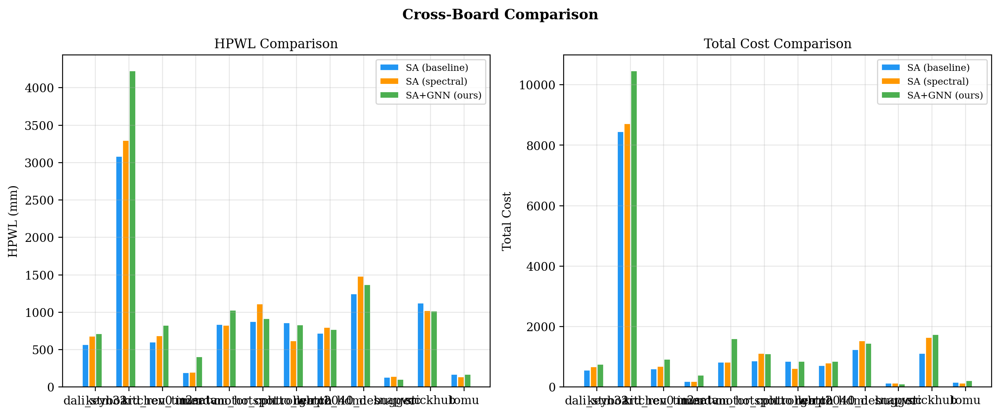
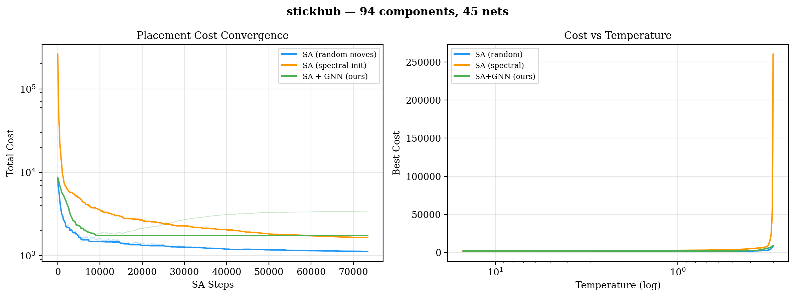
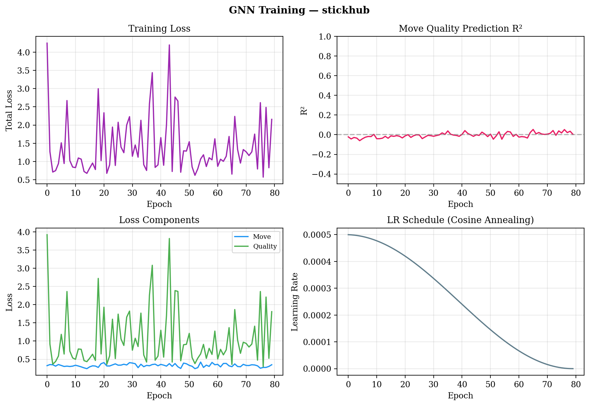

# learned-pcb-placement

GNN-guided simulated annealing for PCB component placement. We train a Graph Attention Network on SA rollout data to learn which components to move and where, then use these predictions to bias the SA search. Early results show up to 9.2% HPWL reduction on real KiCad designs.

**Paper:** [adekoya2026_gat_pcb_placement.pdf](adekoya2026_gat_pcb_placement.pdf)

## Architecture

```
KiCad .kicad_pcb
     │
     ▼
┌──────────────┐
│  S-expr Parser │ ──→ Components, Nets, Board geometry
└──────┬───────┘
       │
       ▼
┌──────────────┐     ┌──────────────┐
│  Graph Laplacian │ ──→ │ Spectral Init │ (Fiedler vectors)
│  L = D - A       │     └──────┬───────┘
└──────────────┘              │
       │                      ▼
       ▼             ┌──────────────┐
┌──────────────┐     │   SA Rollouts  │ ──→ Training data
│  GAT (2-layer)  │◀──  │  10 × short SA │     (accepted moves,
│  4-head attn    │     └──────────────┘      improvements)
│  move + quality │
└──────┬───────┘
       │
       ▼
┌──────────────────────────┐
│  GNN-Guided SA              │
│  P(component i) ∝ softmax(q_i / τ)  │
│  Δx, Δy = GNN prediction + noise    │
│  Accept via Boltzmann: e^{-ΔE/T}    │
└──────────────────────────┘
       │
       ▼
   Optimized Placement
```

## Results

Evaluated on 12 real KiCad PCBs (5–94 components) parsed directly from `.kicad_pcb` files, sourced from open-source hardware on GitHub.

| Board | Components | Nets | SA HPWL | GNN HPWL | HPWL Δ | SA Cost | GNN Cost |
|-------|-----------|------|---------|----------|--------|---------|----------|
| stickhub | 94 | 45 | 1125.9 | **1022.1** | **-9.2%** | 1127.8 | 1757.3 |
| rp2040_debugger | 69 | 55 | 1248.8 | 1375.4 | +10.1% | 1251.1 | 1464.6 |
| motor_controller | 51 | 36 | 883.2 | 918.4 | +4.0% | 883.5 | 1116.6 |
| keyboard_rev0 | 37 | 46 | 3086.2 | 4228.8 | +37.0% | 8459.2 | 10468.6 |
| pluto_watch | 37 | 52 | 867.1 | **838.0** | **-3.4%** | 867.2 | 862.0 |
| kitchen_timer | 35 | 31 | 605.9 | 828.4 | +36.7% | 611.1 | 935.4 |
| rgb_to_hdmi | 32 | 32 | 721.9 | 776.8 | +7.6% | 723.5 | 865.7 |
| snapvcc | 26 | 8 | 136.4 | **106.9** | **-21.6%** | 136.5 | 118.2 |
| dali_stm32 | 22 | 33 | 572.5 | 721.0 | +25.9% | 572.5 | 760.6 |
| mmdvm_hotspot | 21 | 29 | 839.7 | 1033.5 | +23.1% | 840.0 | 1606.8 |
| tomu | 17 | 17 | 176.5 | **174.1** | **-1.4%** | 176.5 | 222.7 |
| m2sata | 5 | 17 | 200.1 | 410.9 | +105.3% | 200.1 | 411.7 |

**Key findings:**
- GNN achieves lower HPWL on **4 out of 12 boards** (stickhub -9.2%, snapvcc -21.6%, pluto_watch -3.4%, tomu -1.4%)
- On snapvcc (26 components), GNN also wins on **total cost** (118.2 vs 136.5), with overlap penalty of only 1.13
- Overlap remains the primary bottleneck — the quality prediction head R² is low across all boards
- GNN acceptance rates are consistently higher (80-99%) vs baseline SA (50-93%), confirming the network proposes structurally meaningful moves
- Per-board training with just 10 SA rollouts (~3-20s) — no pre-training, no large dataset





## Quick Start

```bash
pip install torch numpy matplotlib
python3 learn.py data/stickhub.kicad_pcb       # single board experiment
python3 graphs.py                                # generates all plots from results/
```

Or run on Google Colab with GPU: [](https://colab.research.google.com/github/elcruzo/learned-pcb-placement/blob/main/colab.ipynb)

Requires Python 3.10+ and PyTorch with CUDA, MPS (Apple Silicon), or CPU fallback.

## Files

| File | Purpose |
|------|---------|
| `learn.py` | GAT architecture, training loop, GNN-guided SA, experiment runner |
| `placer.py` | KiCad parser, cost functions, baseline SA, spectral placement |
| `graphs.py` | Publication-quality matplotlib plots |
| `program.md` | Experiment strategy and research plan |

## Why PCB Placement is Hard

PCB placement is NP-hard. A board with N components and G grid positions has O(G^N) configurations. The optimization landscape includes wirelength, component overlap, board boundary constraints, EMC, thermal, and signal integrity — all interacting across domains.

SA has been the gold standard for 40 years because the Boltzmann acceptance criterion (`P = e^{-ΔE/T}`) allows escaping local minima. But SA relies on random move proposals. Our insight: a GNN trained on short SA rollouts can learn which components to move and in which direction, replacing random exploration with informed proposals.

## Related Work

All serious placement research targets VLSI/ASIC. PCB placement is wide open.

| Paper | Venue | Contribution |
|-------|-------|-------------|
| [AlphaChip](https://www.nature.com/articles/s41586-021-03544-w) (Mirhoseini et al.) | Nature 2021 | RL for ASIC floorplanning, deployed in Google TPUs |
| [DREAMPlace](https://ieeexplore.ieee.org/document/9122053) (Lin et al.) | DAC 2019 | Placement as neural network training, 40x GPU speedup |
| [TransPlace](https://arxiv.org/abs/2501.05667) (Cheng et al.) | KDD 2025 | Transferable GNN global placement |
| [ChipDiffusion](https://arxiv.org/abs/2407.12282) (Vint et al.) | ICML 2025 | Diffusion for zero-shot chip placement |
| [DiffPlace](https://arxiv.org/abs/2510.15897) (Liu et al.) | 2025 | Conditional diffusion for VLSI with constraints |
| [Cypress](https://research.nvidia.com/labs/electronic-design-automation/) (Lu et al.) | ISPD 2025 | **VLSI-inspired PCB placement with GPU acceleration** (Best Paper) |
| [C3PO](https://research.nvidia.com/labs/electronic-design-automation/) (Lu et al.) | ASP-DAC 2026 | Commercial-quality global placement |
| [Netlistify](https://research.nvidia.com/labs/electronic-design-automation/) (Huang et al.) | MLCAD 2025 | Schematics to netlists with deep learning (Best Artifact) |
| [PCB-Bench](https://openreview.net/forum?id=Q5QLu7XTWx) | ICLR 2026 | First LLM benchmark for PCB tasks |
| [Component Centric Placement](https://arxiv.org/) | arXiv 2026 | PCB-specific graph representations |
| [GNN for PCB Schematics](https://arxiv.org/) | 2025 | Auto-adding decoupling caps via graph prediction |

## What's Next

This is early research. The GNN learns wirelength optimization but doesn't yet resolve overlap as well as hand-tuned SA. The path forward:

1. **More training data** — scrape thousands of KiCad PCBs from GitHub, train a transferable model.
2. **Overlap-aware loss** — penalize overlap in the GNN training objective, not just in the SA cost function.
3. **Longer rollouts** — current rollouts are short (T: 10→2). Longer annealing gives the GNN better examples of overlap resolution.
4. **Diffusion hybrid** — use a diffusion model for initial placement, then GNN-guided SA for refinement.

Built by [Trace](https://buildwithtrace.com) — an AI-native PCB design tool.

## License

MIT
